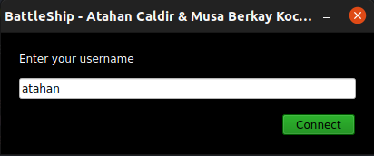
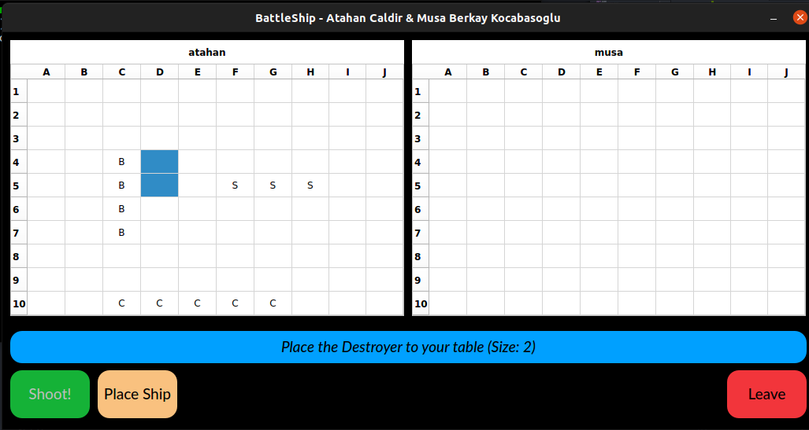
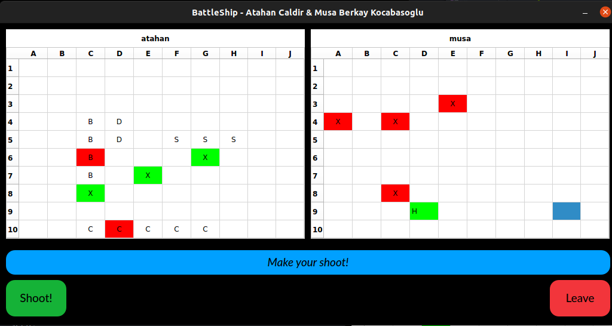

# Battleship game project (CS 447 Project 1)

Project is completely built with Python. Required packages can be found in *requirements.txt* file.

PyQt5 framework is used to create the graphical user interface(GUI).

Majority of the socket side in program is in *network.py* file.

## Setup Environment

- In Windows, we use latest version of PyCharm. When you open project, you need to select interpreter in settings section. This environment selected virtual environment.

- After that open requirements.txt file and click install requirements part.

- Then you need to add configuration settings for running.

- Me and my teammate live in different locations. So, we install the Hamachi application and with this application, we can create local network.

- For another setup solution in Windows is using Anaconda. Anaconda includes required packages except *playsound v1.2.2* package.

  `pip install playsound==1.2.2`

- However, we took the best results in Ubuntu 21.04. You can use either PyCharm or Anaconda.

## Instructions

1. Server need to firstly run. After that client should run.
2. After the connection, both sides should place their ships on the left table to start battle.
3. Then, server side starts shooting area of the right table. After each shooting, the shoot turn will change from the current user to the other user.

## Screenshots

**Figure 1:** Users start the game with typing their usernames.

**Figure 2:** Users place their ships after the connection is established.

**Figure 3:** Users see their hit and missed shots.

## Q&A

* In Windows, the sounds does not play. How to fix it?

 Use the playground package with version 1.2.2. The version 1.3.0 has issues in Windows. We solve this problem with *reqirements.txt* file. 

- What if one of the players left the game before ending?

The program can freeze because some of the threading issues but warning message would pop-up and user can be aware of this situation.